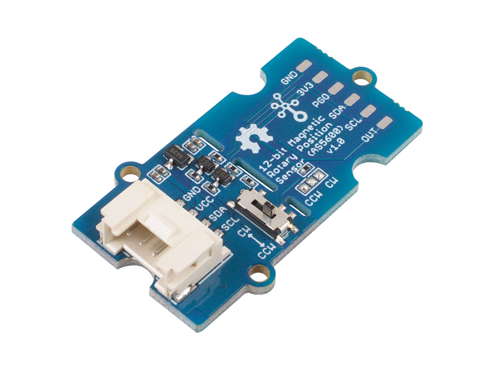

# Pi-AS5600


## Background

This is a C port driver for operating a Grove - 12-bit Magnetic Rotary Position Sensor / Encoder (AS5600) via I2C on a Raspberry Pi.
More info for the sensor can been found: https://wiki.seeedstudio.com/Grove-12-bit-Magnetic-Rotary-Position-Sensor-AS5600/
Datasheet of the AS5600:  https://github.com/SeeedDocument/Grove-12-bit-Magnetic-Rotary-Position-Sensor-AS5600/blob/master/res/Magnetic%20Rotary%20Position%20Sensor%20AS5600%20Datasheet.pdf

Original the code can be found in the repo: https://github.com/libdriver/as5600


For WayWise we cherrypick the relevant code for raspberry-pi 4b.


## I2C bus connection
For I2C communication functions, you can use the i2c-tools and i2c-dev packages.

```
sudo apt-get install -y i2c-tools libi2c-dev
```
Now we can use the i2cdetect command to query the I2C bus.  Connecting the AS-5600 sensor to the Raspberry Pi I2C bus, the sensor responds with the slave address 0x36. The groove sensor responds by default under 0x36.

```
# i2cdetect -y 1
     0  1  2  3  4  5  6  7  8  9  a  b  c  d  e  f
00:                         -- -- -- -- -- -- -- -- 
10: -- -- -- -- -- -- -- -- -- -- -- -- -- -- -- -- 
20: -- -- -- -- -- -- -- -- -- -- -- -- -- -- -- -- 
30: -- -- -- -- -- -- 36 -- -- -- -- -- -- -- -- -- 
40: -- -- -- -- -- -- -- -- -- -- -- -- -- -- -- -- 
50: -- -- -- -- -- -- -- -- -- -- -- -- -- -- -- -- 
60: -- -- -- -- -- -- -- -- -- -- -- -- -- -- -- -- 
70: -- -- -- -- -- -- -- --  
```

## Send commands to the sensor
There are four shell scripts to interact directely with the sensor.

### Read the scaled angle and raw values:

```
#./ReadAngle.sh 
Scaled angle is  4095
Raw angle is  0
```

### Set the start position using i2cset (ZPOS Register):
```
# ./SetStartPosition.sh 
High byte set successfully
Low byte set successfully.
Start position set successfully.
```


### Set the stop position using i2cset (MPOS Register)
```
./SetStopPosition.sh 
High byte set successfully.
Low byte set successfully.
Stop position set successfully.
```


### Read the start and stop Position:

```
# ./ReadStartStopPosition.sh 
Start poistion is 0
Stop poistion is 0
```